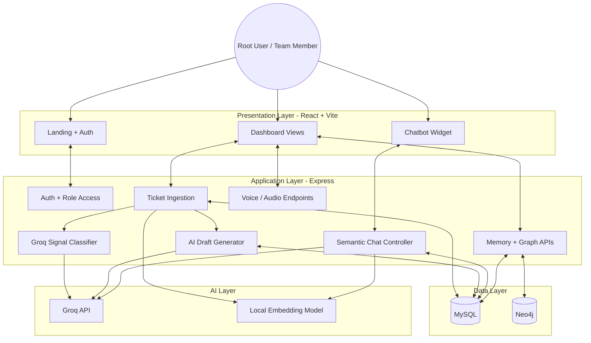

# Sales Ticket - Revenue Signal Intelligence From Support Conversations

Sales Ticket is an AI-powered support intelligence platform that turns incoming customer tickets into business signals, account health insights, semantic memory, draft responses, graph relationships, and conversational retrieval.

Instead of treating support tickets as isolated helpdesk items, this project converts them into structured revenue intelligence for teams like product, customer success, and sales.

---

## Overview

The platform ingests Zendesk-style ticket payloads, classifies them with Groq, stores outputs in MySQL, builds graph relationships in Neo4j-backed views, generates semantic embeddings for retrieval, and exposes everything through a React dashboard with an AI copilot.

Core outcomes:

- detect revenue-relevant ticket signals
- route signals to the right internal role
- generate AI draft replies
- measure account health and momentum
- build account memory and timelines
- support semantic chat with session memory
- surface voice-of-customer and graph-based views

---

## Problem

Support teams capture some of the most valuable customer signals in a company, but those signals usually stay trapped inside tickets.

That creates several issues:

- product teams miss repeated feature requests or friction themes
- customer success teams discover churn risk too late
- sales teams miss expansion or account risk context
- teams have no shared memory across customer interactions
- raw ticket volume makes manual triage slow and inconsistent

---

## Solution

Sales Ticket turns support activity into structured account intelligence:

1. **Ingest** - Accept ticket payloads from Zendesk-style sources.
2. **Store** - Save ticket data in MySQL.
3. **Classify** - Use Groq to detect business signals such as `expansion`, `churn_risk`, `competitor_mention`, and `feature_gap`.
4. **Route** - Assign each signal to a role such as product manager, customer success manager, or account executive.
5. **Draft** - Generate AI responses tailored to the detected signal.
6. **Embed** - Store semantic embeddings for tickets and conversations.
7. **Retrieve** - Use embeddings plus cosine similarity to power chat and memory lookup.
8. **Visualize** - Surface account health, timelines, graph views, voice views, and role-aware dashboards.

---

## Product Areas

The dashboard currently includes:

- **All Tickets** - ticket list with filters, role-specific signal views, and detail modals
- **Account Health Score** - summary cards, graph visualization, signal distribution, and health indicators
- **Account Memory & Timeline** - timeline of touchpoints, AI summaries, action items, and account drilldown
- **AI-generated Playbooks and Drafts** - generated drafts and response workflows
- **Ask Intelligence** - workspace for intelligence-oriented interactions
- **Voice of Customer Reporting** - audio ticket and voice workflow support
- **Settings**
- **Add Team**
- **Edit Details**
- **Chat Copilot** - floating assistant with semantic session memory

---

## Screenshots / Demo Links

Add these after you share the final links:

- Landing page:
- Login / Register:
- Dashboard overview:
- All Tickets:
- Account Health:
- Account Memory:
- Playbooks:
- Ask Intelligence:
- Voice of Customer:
- Settings:
- Demo video:

---

## Architecture

```text
Zendesk / Ticket Payload
        |
        v
Express Backend (Node.js)
        |
        ├─ Auth + Role Access
        ├─ Ticket Ingestion
        ├─ Signal Classification (Groq)
        ├─ AI Draft Generation
        ├─ Embedding Generation
        ├─ Chat Retrieval + Memory
        ├─ Graph / Health APIs
        └─ Voice / Audio Endpoints
        |
        +--------------------+
        |                    |
        v                    v
   MySQL Database        Neo4j Graph
        |                    |
        ├─ users             ├─ account / ticket / signal graph views
        ├─ tickets           └─ graph-backed analytics endpoints
        ├─ ticket_signals
        ├─ ai_drafts
        ├─ embeddings
        ├─ chat_embeddings
        └─ audio_tickets
        |
        v
React + Vite Frontend
        |
        ├─ Dashboard
        ├─ Ticket Views
        ├─ Health + Timeline Views
        ├─ Graph Visualizations
        ├─ Voice UI
        └─ Chatbot Widget
```



---

## Key Features

**AI Signal Classification**  
Support tickets are analyzed with Groq and converted into structured business signals like churn risk, expansion opportunity, competitor mention, and feature gap.

**Role-based Routing**  
Signals are mapped to internal personas such as product manager, customer success manager, and account executive.

**AI Draft Generation**  
Draft responses are automatically created from ticket context and signal type, helping teams respond faster and more consistently.

**Semantic Retrieval**  
The project generates embeddings for both tickets and chat sessions. These embeddings power retrieval for the assistant and account memory workflows.

**Chat With Session Memory**  
The chat assistant stores session-specific conversation embeddings and retrieves both ticket context and current-session conversational context.

**Account Health Scoring**  
Account health is derived from signal distribution and other risk indicators, then exposed in dashboard cards and graph-driven views.

**Account Timeline / Memory**  
Teams can inspect account history, AI summaries, activity streams, and action items in one place.

**Graph-based Views**  
Account, ticket, and signal relationships are surfaced in graph-oriented interfaces using Neo4j-backed APIs.

**Voice Ticket Support**  
Voice and voicemail ticket paths are detected separately and exposed through dedicated endpoints and frontend views.

**Role-aware Access Model**  
The platform supports root-user login and role-specific access accounts created using passkeys.

---

## Tech Stack

| Layer | Technology |
| --- | --- |
| Frontend | React 19, Vite, React Router, React Query |
| UI / Charts | D3, Chart.js, React Icons, Tailwind/PostCSS |
| Backend | Node.js, Express |
| Database | MySQL (`mysql2`) |
| Graph Layer | Neo4j |
| AI / LLM | Groq SDK |
| Embeddings | `@xenova/transformers` local MiniLM model |
| Auth | JWT, bcrypt |
| Email / Delivery | Nodemailer |

---

## Repository Structure

```text
Sales_Ticket/
├─ client/
│  ├─ public/
│  ├─ src/
│  │  ├─ components/
│  │  │  ├─ Landing/
│  │  │  ├─ LoginRegister/
│  │  │  └─ dashboard/
│  │  ├─ context/
│  │  ├─ App.jsx
│  │  └─ main.jsx
│  ├─ package.json
│  └─ vite.config.js
├─ server/
│  ├─ config/
│  ├─ controllers/
│  ├─ middlewares/
│  ├─ models/
│  ├─ routes/
│  ├─ utils/
│  ├─ req.http
│  ├─ rag.http
│  ├─ server.js
│  └─ package.json
└─ README.md
```

---

## Getting Started

### Prerequisites

- Node.js 18+
- npm
- MySQL
- Neo4j
- Groq API key

Optional depending on feature usage:

- Zendesk API credentials
- SMTP/email configuration

### Quick Start

#### 1. Clone the repository

```bash
git clone <your-repo-url>
cd Sales_Ticket
```

#### 2. Install backend dependencies

```bash
cd server
npm install
```

#### 3. Install frontend dependencies

```bash
cd ../client
npm install
```

#### 4. Create environment files

Create `server/.env` and optionally `client/.env` using the examples below.

#### 5. Start MySQL and Neo4j

Make sure both services are running and accessible from the backend.

#### 6. Start the backend

```bash
cd server
node server.js
```

For auto-reload:

```bash
cd server
npx nodemon server.js
```

#### 7. Start the frontend

```bash
cd client
npm run dev
```

#### 8. Open the app

Frontend:

- `http://localhost:5173`

Backend:

- `http://localhost:5000`

---

## Environment Configuration

### Backend `.env`

Create `server/.env`:

```env
PORT=5000

DB_HOST=localhost
DB_PORT=3306
DB_USER=your_mysql_user
DB_PASSWORD=your_mysql_password
DB_NAME=sales_ticket
DB_SSL=false

NEO4J_URI=bolt://localhost:7687
NEO4J_USERNAME=neo4j
NEO4J_PASSWORD=your_neo4j_password

JWT_SECRET=replace_with_a_secure_secret
GROQ_API_KEY=your_groq_api_key

ZENDESK_EMAIL=your_agent_email
ZENDESK_API_TOKEN=your_zendesk_api_token
```

### Frontend `.env`

Optional `client/.env`:

```env
VITE_API_URL=http://localhost:5000/api
```

Notes:

- the client already defaults to `http://localhost:5000/api`
- Zendesk credentials are required for Zendesk-integrated voice/audio flows
- `DB_SSL=false` is useful for local development

---

## Database And Service Setup

### MySQL

Create the database:

```sql
CREATE DATABASE sales_ticket;
```

The backend expects tables such as:

- `users`
- `access_accounts`
- `zendesk_accounts`
- `tickets`
- `ticket_signals`
- `ai_drafts`
- `embeddings`
- `chat_embeddings`
- `audio_tickets`

If you deploy this elsewhere, make sure the schema matches the queries in `server/controllers/` and `server/models/`.

### Neo4j

Configure:

- `NEO4J_URI`
- `NEO4J_USERNAME`
- `NEO4J_PASSWORD`

The backend tests Neo4j connectivity on startup in [server/server.js](server/server.js).

### Groq

Set:

- `GROQ_API_KEY`

Groq powers:

- signal classification
- AI draft generation
- chat responses

### Zendesk

If you want voice/audio and Zendesk resource access to work, configure:

- `ZENDESK_EMAIL`
- `ZENDESK_API_TOKEN`

---

## Running On Another Machine

To set this project up in any new environment:

1. Clone the repository.
2. Install Node.js, npm, MySQL, and Neo4j.
3. Create `server/.env`.
4. Create `client/.env` if you need a custom API base.
5. Install backend dependencies in `server/`.
6. Install frontend dependencies in `client/`.
7. Start MySQL.
8. Start Neo4j.
9. Start the backend.
10. Start the frontend.
11. Verify auth, ticket routes, and chat routes.
12. If using webhooks, point the external sender to the new backend URL.

---

## Available Scripts

### Client

From `client/`:

```bash
npm run dev
npm run build
npm run preview
npm run lint
```

### Server

From `server/`:

```bash
node server.js
npx nodemon server.js
```

---

## API Overview

### Auth / Users

| Method | Path | Description |
| --- | --- | --- |
| POST | `/api/users/register` | Register root user |
| POST | `/api/users/login` | Root login |
| POST | `/api/users/create-role` | Create role access account |
| POST | `/api/users/role-login` | Login with role passkey |
| GET | `/api/users/zendesk-context` | Initialize Zendesk context |

### Tickets / Signals / Drafts

| Method | Path | Description |
| --- | --- | --- |
| POST | `/api/tickets` | Ingest ticket payload |
| GET | `/api/tickets/:userId` | Fetch tickets for a user |
| POST | `/api/signals` | Fetch signals for a role |
| POST | `/api/tickets/drafts` | Fetch AI drafts by role |
| POST | `/api/tickets/drafts/update` | Update a draft |
| POST | `/api/tickets/drafts/send` | Send draft reply |

### Chat

| Method | Path | Description |
| --- | --- | --- |
| POST | `/api/chat/session/start` | Start semantic chat session |
| POST | `/api/chat` | Send chat message |
| POST | `/api/chat/clear` | Clear session or user chat history |

### Memory / Graph / Voice

| Area | Base Path |
| --- | --- |
| Memory | `/api/memory/*` |
| Graph | `/api/graph/*` |
| Audio tickets | `/api/audio-tickets/*` |

---

## Semantic Retrieval Design

The project uses two embedding stores:

### `embeddings`

Stores ticket-level semantic records used by chat and account intelligence.

Typical fields:

- `ticket_id`
- `account_id`
- `content`
- `embedding`
- `type`
- `metadata`

### `chat_embeddings`

Stores session-scoped conversation turns for semantic memory.

Typical fields:

- `user_id`
- `account_id`
- `type`
- `content`
- `embedding`
- `metadata`
- `session_id`

### Retrieval Flow

1. user sends chat message
2. backend generates query embedding
3. backend fetches ticket embeddings for the account
4. backend fetches conversation embeddings for the current session
5. cosine similarity ranks relevant rows
6. Groq replies using ticket context plus past conversation context

---

## Ticket Intelligence Pipeline

The ticket flow in [server/controllers/ticketController.js](server/controllers/ticketController.js) works like this:

1. accept incoming Zendesk-style ticket payload
2. detect whether the ticket is text or voice-related
3. map `zendesk_account_id` to an internal user
4. save or update the ticket
5. classify ticket signals with Groq
6. save signals into `ticket_signals`
7. generate AI drafts and save to `ai_drafts`
8. generate ticket embeddings and save to `embeddings`

---

## Frontend Architecture

The frontend is a React dashboard built around:

- auth flows
- a sidebar-driven dashboard shell
- role-aware ticket and signal views
- graph and chart-heavy visualizations
- a floating semantic chatbot

Important files:

- [client/src/App.jsx](client/src/App.jsx)
- [client/src/context/AuthContext.jsx](client/src/context/AuthContext.jsx)
- [client/src/components/dashboard/Dashboard.jsx](client/src/components/dashboard/Dashboard.jsx)
- [client/src/components/dashboard/Sidebar.jsx](client/src/components/dashboard/Sidebar.jsx)
- [client/src/components/dashboard/ChatbotWidget.jsx](client/src/components/dashboard/ChatbotWidget.jsx)

Major views:

- [client/src/components/dashboard/views/AllTickets.jsx](client/src/components/dashboard/views/AllTickets.jsx)
- [client/src/components/dashboard/views/AccountHealthView.jsx](client/src/components/dashboard/views/AccountHealthView.jsx)
- [client/src/components/dashboard/views/AccountMemoryView.jsx](client/src/components/dashboard/views/AccountMemoryView.jsx)
- [client/src/components/dashboard/views/PlaybooksView.jsx](client/src/components/dashboard/views/PlaybooksView.jsx)
- [client/src/components/dashboard/views/VoiceView.jsx](client/src/components/dashboard/views/VoiceView.jsx)

---

## Backend Architecture

Important backend files:

- [server/server.js](server/server.js) - app bootstrap and route wiring
- [server/controllers/userController.js](server/controllers/userController.js) - auth, role login, Zendesk context
- [server/controllers/ticketController.js](server/controllers/ticketController.js) - ticket ingest, signal storage, drafts, embeddings, audio flows
- [server/controllers/chatController.js](server/controllers/chatController.js) - semantic chat, session memory, retrieval
- [server/controllers/memoryController.js](server/controllers/memoryController.js) - account memory data
- [server/controllers/graphController.js](server/controllers/graphController.js) - graph and health APIs
- [server/utils/groqClassifier.js](server/utils/groqClassifier.js) - signal classification
- [server/utils/aiDraftGenerator.js](server/utils/aiDraftGenerator.js) - AI draft generation
- [server/utils/embedding.js](server/utils/embedding.js) - local embedding generation

---

## Testing And Manual Request Files

Useful included files:

- [server/req.http](server/req.http)
- [server/rag.http](server/rag.http)

Use them to test:

- registration and login
- role creation and role login
- ticket ingestion
- signal fetching
- chat session start
- RAG chat behavior

---

## Deployment Notes

This repo does not currently include a full production deployment configuration, but the expected production setup would typically involve:

- frontend hosted as static assets or behind a Node/web server
- backend hosted as a long-running Node process
- MySQL and Neo4j as managed or self-hosted services
- reverse proxy such as Nginx
- HTTPS termination at the edge

At minimum for deployment:

1. provision MySQL
2. provision Neo4j
3. set environment variables on the server
4. build and host the frontend
5. run the backend with a process manager like PM2
6. configure external webhook sources to point to the backend base URL

---

## Troubleshooting

### Backend starts but dashboard has no data

Check:

- MySQL connection values in `server/.env`
- whether required tables exist
- whether `zendesk_accounts` contains mappings for incoming ticket account IDs

### Chat replies but ignores ticket context

Check:

- rows exist in `embeddings`
- rows exist in `chat_embeddings`
- embedding generation is not failing in backend logs

### Voice routes fail

Check:

- Zendesk credentials
- voice ticket payload shape
- whether the audio URL returned by Zendesk is valid

### Signal classification returns nothing

Check:

- `GROQ_API_KEY`
- outbound internet access
- ticket text has meaningful subject/description content

### Neo4j features fail

Check:

- `NEO4J_URI`
- `NEO4J_USERNAME`
- `NEO4J_PASSWORD`
- Neo4j server availability

---

## Future README Additions

Once you provide your page links, this README can be extended with:

- screenshot galleries
- hosted demo links
- page-by-page walkthroughs
- feature callouts with visuals
- deployment diagrams
- setup screenshots

---

## License

No license file is currently included in this repository. Add one if you want explicit distribution and usage terms.
