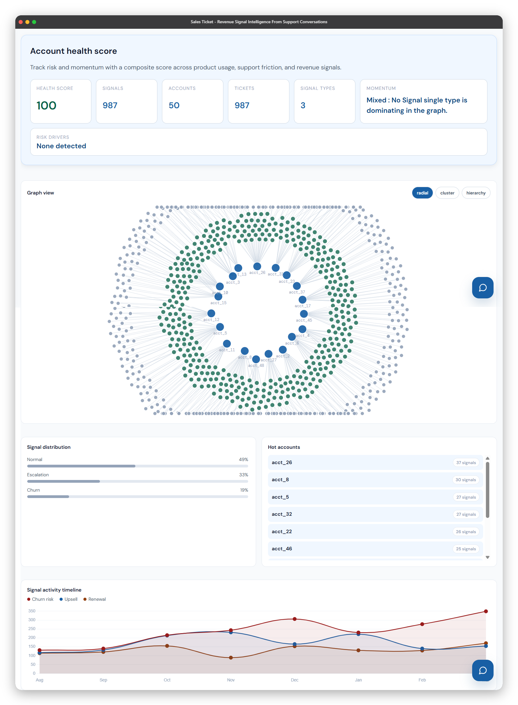
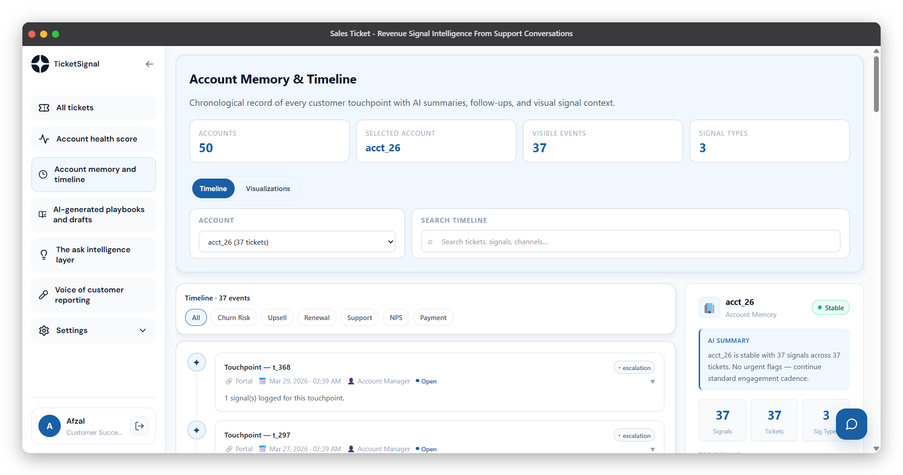
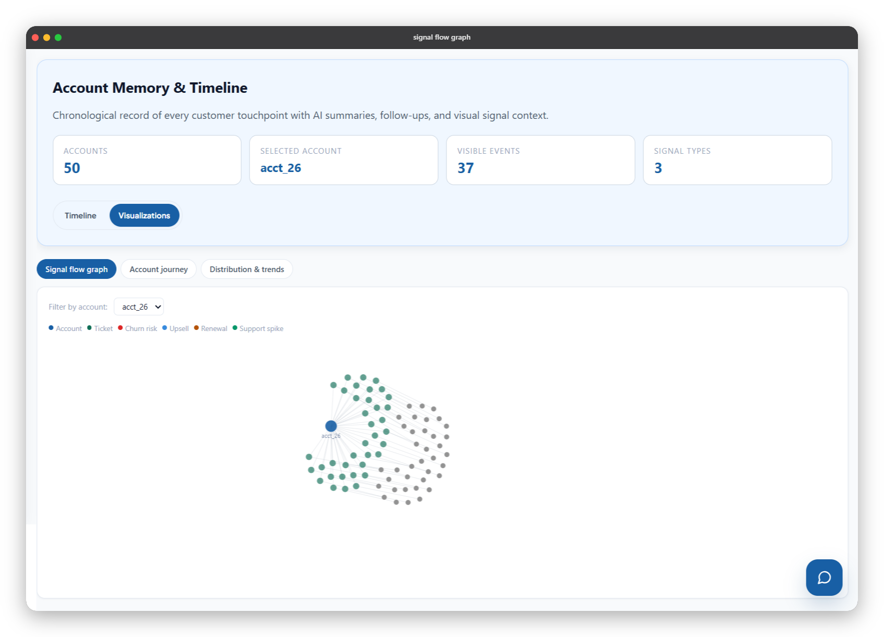
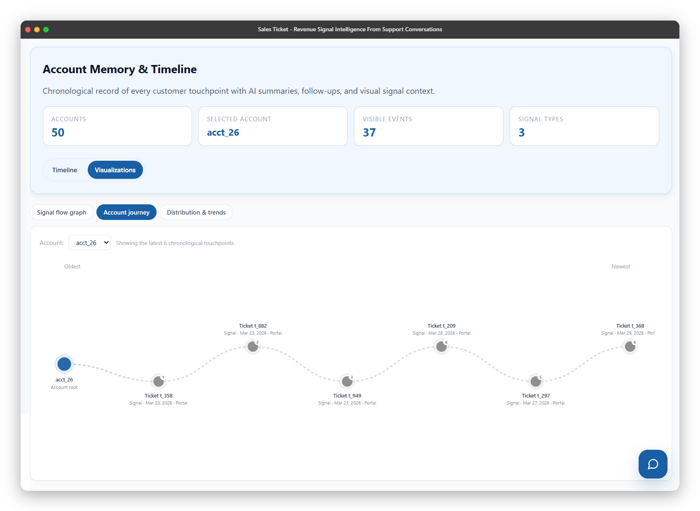
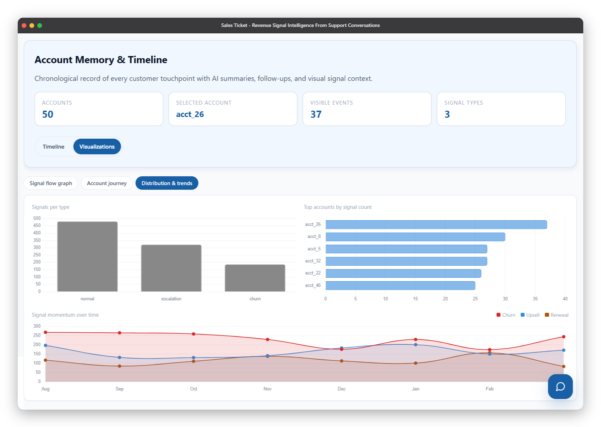
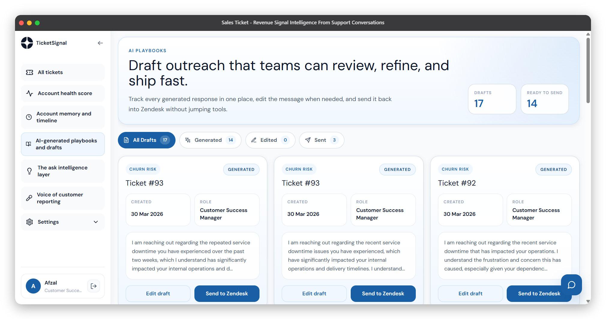
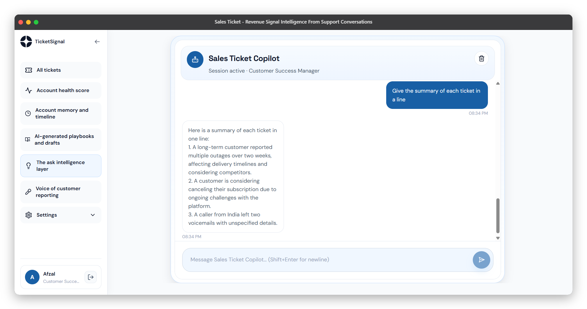
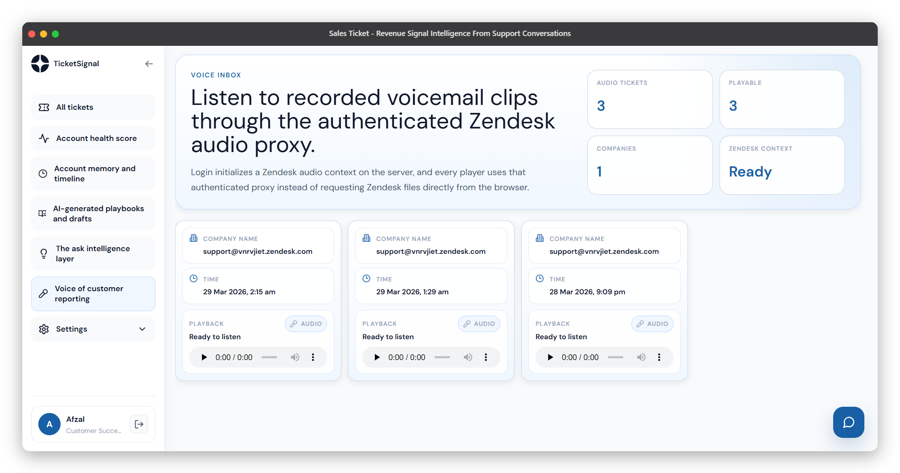
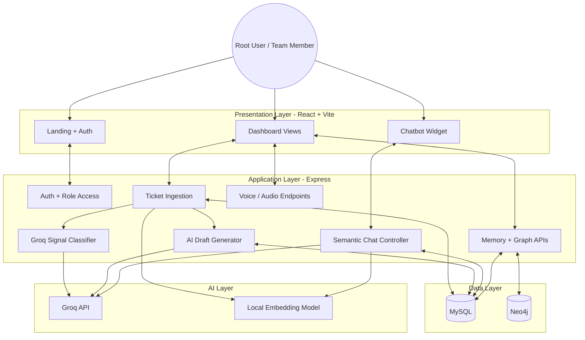

# Sales Ticket - Revenue Signal Intelligence From Support Conversations

Sales Ticket is an AI-powered support intelligence platform that turns incoming customer tickets into business signals, account health insights, semantic memory, draft responses, graph relationships, and conversational retrieval.

Instead of treating support tickets as isolated helpdesk items, this project converts them into structured revenue intelligence for teams like product, customer success, and sales.

---

## Overview

The platform ingests Zendesk-style ticket payloads, classifies them with Groq, stores outputs in MySQL, builds graph relationships in Neo4j-backed views, generates semantic embeddings for retrieval, and exposes everything through a React dashboard with an AI copilot.

Core outcomes:

- detect revenue-relevant ticket signals
- route signals to the right internal role
- generate AI draft replies
- measure account health and momentum
- build account memory and timelines
- support semantic chat with session memory
- surface voice-of-customer and graph-based views

---

## Problem

Support teams capture some of the most valuable customer signals in a company, but those signals usually stay trapped inside tickets.

That creates several issues:

- Product teams miss repeated feature requests or friction themes
- Customer success teams discover churn risk too late
- Sales teams miss expansion or account risk context
- Teams have no shared memory across customer interactions
- Raw ticket volume makes manual triage slow and inconsistent

---

## Solution

Sales Ticket turns support activity into structured account intelligence:

1. **Ingest** - Accept ticket payloads from Zendesk-style sources.
2. **Store** - Save ticket data in MySQL.
3. **Classify** - Use Groq to detect business signals such as `expansion`, `churn_risk`, `competitor_mention`, and `feature_gap`.
4. **Route** - Assign each signal to a role such as product manager, customer success manager, or account executive.
5. **Draft** - Generate AI responses tailored to the detected signal.
6. **Embed** - Store semantic embeddings for tickets and conversations.
7. **Retrieve** - Use embeddings plus cosine similarity to power chat and memory lookup.
8. **Visualize** - Surface account health, timelines, graph views, voice views, and role-aware dashboards.

---

## Screenshots / Demo Links

- All Tickets:


- Account Health:



- Account Memory:






- Playbooks:



- Ask Intelligence:



- Voice of Customer:




---

## Architecture

```text
Zendesk / Ticket Payload
        |
        v
Express Backend (Node.js)
        |
        +-- Auth + Role Access
        +-- Ticket Ingestion
        +-- Signal Classification (Groq)
        +-- AI Draft Generation
        +-- Embedding Generation
        +-- Chat Retrieval + Memory
        +-- Graph / Health APIs
        +-- Voice / Audio Endpoints
        |
        +--------------------+
        |                    |
        v                    v
   MySQL Database        Neo4j Graph
        |                    |
        +-- users            +-- account / ticket / signal graph views
        +-- tickets          +-- graph-backed analytics endpoints
        +-- ticket_signals
        +-- ai_drafts
        +-- embeddings
        +-- chat_embeddings
        +-- audio_tickets
        |
        v
React + Vite Frontend
        |
        +-- Dashboard
        +-- Ticket Views
        +-- Health + Timeline Views
        +-- Graph Visualizations
        +-- Voice UI
        +-- Chatbot Widget
```



---

## Key Features

**AI Signal Classification**  
Support tickets are analyzed with Groq and converted into structured business signals like churn risk, expansion opportunity, competitor mention, and feature gap.

**Role-based Routing**  
Signals are mapped to internal personas such as product manager, customer success manager, and account executive.

**AI Draft Generation**  
Draft responses are automatically created from ticket context and signal type, helping teams respond faster and more consistently.

**Semantic Retrieval**  
The project generates embeddings for both tickets and chat sessions. These embeddings power retrieval for the assistant and account memory workflows.

**Chat With Session Memory**  
The chat assistant stores session-specific conversation embeddings and retrieves both ticket context and current-session conversational context.

**Account Health Scoring**  
Account health is derived from signal distribution and other risk indicators, then exposed in dashboard cards and graph-driven views.

**Account Timeline / Memory**  
Teams can inspect account history, AI summaries, activity streams, and action items in one place.

**Graph-based Views**  
Account, ticket, and signal relationships are surfaced in graph-oriented interfaces using Neo4j-backed APIs.

**Voice Ticket Support**  
Voice and voicemail ticket paths are detected separately and exposed through dedicated endpoints and frontend views.

**Role-aware Access Model**  
The platform supports root-user login and role-specific access accounts created using passkeys.

---

## Tech Stack

| Layer | Technology |
| --- | --- |
| Frontend | React 19, Vite, React Router, React Query |
| UI / Charts | D3, Chart.js, React Icons, Tailwind/PostCSS |
| Backend | Node.js, Express |
| Database | MySQL (`mysql2`) |
| Graph Layer | Neo4j |
| AI / LLM | Groq SDK |
| Embeddings | `@xenova/transformers` local MiniLM model |
| Auth | JWT, bcrypt |
| Email / Delivery | Nodemailer |

---

## Getting Started

### Prerequisites

- Node.js 18+
- npm
- MySQL
- Neo4j
- Groq API key

Optional depending on feature usage:

- Zendesk API credentials
- SMTP/email configuration

### Quick Start

```bash
git clone <your-repo-url>
cd Sales_Ticket
cd server
npm install
cd ../client
npm install
```

Create `server/.env` and optionally `client/.env`, start MySQL and Neo4j, then run:

```bash
cd server
node server.js
```

```bash
cd client
npm run dev
```

- Frontend: `http://localhost:5173`
- Backend: `http://localhost:5000`

---

## Environment And Service Setup

Use this section for frontend, backend, and database setup together.

### Backend `server/.env`

```env
PORT=5000
DB_HOST=localhost
DB_PORT=3306
DB_USER=your_mysql_user
DB_PASSWORD=your_mysql_password
DB_NAME=sales_ticket
DB_SSL=false
NEO4J_URI=bolt://localhost:7687
NEO4J_USERNAME=neo4j
NEO4J_PASSWORD=your_neo4j_password
JWT_SECRET=replace_with_a_secure_secret
GROQ_API_KEY=your_groq_api_key
ZENDESK_EMAIL=your_agent_email
ZENDESK_API_TOKEN=your_zendesk_api_token
```

### Frontend `client/.env`

```env
VITE_API_URL=http://localhost:5000/api
```

### Services

| Service | Setup |
| --- | --- |
| Frontend | Install dependencies in `client/` and run `npm run dev` |
| Backend | Install dependencies in `server/` and run `node server.js` or `npx nodemon server.js` |
| MySQL | Create `sales_ticket` and ensure app tables match backend queries |
| Neo4j | Set `NEO4J_URI`, `NEO4J_USERNAME`, and `NEO4J_PASSWORD` |
| Groq | Set `GROQ_API_KEY` for signal classification, drafts, and chat |
| Zendesk | Set `ZENDESK_EMAIL` and `ZENDESK_API_TOKEN` for Zendesk-linked flows |

```sql
CREATE DATABASE sales_ticket;
```

---

## API Overview

| Method | Path | Description |
| --- | --- | --- |
| POST | `/api/users/register` | Register the root user |
| POST | `/api/users/login` | Root user login |
| POST | `/api/users/create-role` | Create a role-based access account |
| POST | `/api/users/role-login` | Login with a role passkey |
| GET | `/api/users/zendesk-context` | Load Zendesk-linked context |
| POST | `/api/tickets` | Ingest a Zendesk-style ticket payload |
| GET | `/api/tickets/:userId` | Fetch tickets for a user |
| POST | `/api/signals` | Fetch signals for a role |
| POST | `/api/tickets/drafts` | Fetch AI drafts by role |
| POST | `/api/tickets/drafts/update` | Update a saved draft |
| POST | `/api/tickets/drafts/send` | Send a draft reply |
| POST | `/api/chat/session/start` | Start a semantic chat session |
| POST | `/api/chat` | Send a chat message and retrieve context |
| POST | `/api/chat/clear` | Clear session or user chat history |
| GET | `/api/memory/*` | Read account memory and timeline data |
| GET | `/api/graph/*` | Read graph and health analytics |
| GET | `/api/audio-tickets/*` | Read voice and audio ticket data |

---

## Intelligence And Retrieval Flow

Sales Ticket processes tickets and chat in one compact pipeline:

1. ingest a Zendesk-style `ticket` payload or a chatbot `message`
2. map `zendesk_account_id` to the internal `user_id` / `account_id` and store the core record in MySQL tables like `tickets`
3. classify business signals with Groq and save them into `ticket_signals`
4. generate AI drafts and store them in `ai_drafts`
5. generate semantic vectors for ticket content and save them in `embeddings`
6. store session-based chat turns in `chat_embeddings` using keys like `user_id`, `account_id`, and `session_id`
7. retrieve matching rows from `embeddings` and `chat_embeddings` using cosine similarity over the generated `embedding`
8. return context-aware outputs for chat, account memory, health views, and draft workflows

The `embeddings` table powers ticket-level semantic retrieval for account intelligence, while `chat_embeddings` preserves session-scoped conversation memory for the assistant.

---

## System Notes And Testing

- **Frontend** - A React dashboard that manages authentication, role-aware navigation, ticket and account views, graph and health visualizations, voice workflows, and the floating copilot experience.
- **Backend** - An Express API layer that handles auth, ticket ingestion, signal classification, AI draft generation, semantic embeddings, chat retrieval, memory APIs, graph endpoints, and voice-related processing.

Frontend components shown in the dashboard:

- **All tickets** - [client/src/components/dashboard/views/AllTickets.jsx](client/src/components/dashboard/views/AllTickets.jsx)
- **Account health score** - [client/src/components/dashboard/views/AccountHealthView.jsx](client/src/components/dashboard/views/AccountHealthView.jsx)
- **Account memory and timeline** - [client/src/components/dashboard/views/AccountMemoryView.jsx](client/src/components/dashboard/views/AccountMemoryView.jsx)
- **AI-generated playbooks and drafts** - [client/src/components/dashboard/views/PlaybooksView.jsx](client/src/components/dashboard/views/PlaybooksView.jsx)
- **The ask intelligence layer** - [client/src/components/dashboard/views/AskIntelView.jsx](client/src/components/dashboard/views/AskIntelView.jsx)
- **Voice of customer reporting** - [client/src/components/dashboard/views/VoiceView.jsx](client/src/components/dashboard/views/VoiceView.jsx)
- **Dashboard shell and navigation** - [client/src/components/dashboard/Dashboard.jsx](client/src/components/dashboard/Dashboard.jsx), [client/src/components/dashboard/Sidebar.jsx](client/src/components/dashboard/Sidebar.jsx), [client/src/components/dashboard/SidebarLinkGroup.jsx](client/src/components/dashboard/SidebarLinkGroup.jsx), [client/src/components/dashboard/navItems.js](client/src/components/dashboard/navItems.js)
- **Shared auth and chatbot layer** - [client/src/context/AuthContext.jsx](client/src/context/AuthContext.jsx), [client/src/components/dashboard/ChatbotWidget.jsx](client/src/components/dashboard/ChatbotWidget.jsx)

Backend files used by those frontend components:

- [server/server.js](server/server.js) - main API wiring for dashboard, ticket, draft, chat, memory, graph, and audio endpoints
- [server/controllers/ticketController.js](server/controllers/ticketController.js) - used by All Tickets, Playbooks and Drafts, and Voice of Customer Reporting
- [server/controllers/graphController.js](server/controllers/graphController.js) - used by Account Health Score and parts of Account Memory and Timeline
- [server/controllers/memoryController.js](server/controllers/memoryController.js) - used by Account Memory and Timeline
- [server/controllers/chatController.js](server/controllers/chatController.js) - used by The Ask Intelligence Layer and the floating chatbot
- [server/controllers/userController.js](server/controllers/userController.js) - used by auth flows and Zendesk-linked user context
- [server/controllers/emailController.js](server/controllers/emailController.js) - supports outbound draft and email-related flows
- [server/utils/groqClassifier.js](server/utils/groqClassifier.js) - powers ticket signal classification used across intelligence views
- [server/utils/embedding.js](server/utils/embedding.js) - powers semantic retrieval for chat and memory experiences

Manual API checks are included in:

- [server/req.http](server/req.http)
- [server/rag.http](server/rag.http)

These cover auth, role login, ticket ingestion, signal fetching, draft flows, session start, and RAG chat behavior.

---

This project was built for the hackathon - **Mission: Schrodinger's Cat** conducted by **SRM University**.
